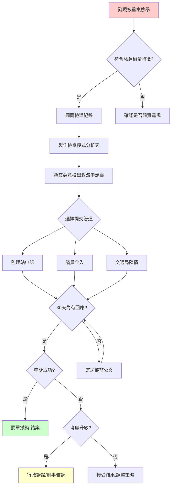

# 惡意檢舉救濟 SOP 流程 (L2-L3 等級)

> **使用時機**：懷疑遭受**報復性檢舉**或**濫用檢舉制度**時使用。

---

## ⚠️ 什麼是「惡意檢舉」？

根據實務經驗，以下情況可能構成惡意檢舉：

| 特徵 | 說明 | 嚴重程度 |
|------|------|----------|
| **同一人重複檢舉** | 3 個月內被同一檢舉人檢舉超過 5 次 | 🔴 高 |
| **檢舉時間規律** | 每次檢舉時間點固定（如：每週一早上 8 點） | 🔴 高 |
| **檢舉地點集中** | 檢舉地點都在你的住家或工作地點附近 | 🔴 高 |
| **檢舉內容牽強** | 檢舉事由不明確或證據不足（如：只拍到車牌） | 🟡 中 |
| **私人糾紛背景** | 檢舉發生在與鄰居/同事發生衝突之後 | 🟡 中 |

---

## 📊 惡意檢舉自動檢測表

請根據你的情況勾選，勾選越多項，惡意檢舉可能性越高。

- [ ] 近 3 個月內收到超過 3 張罰單，且都是「民眾檢舉」
- [ ] 檢舉地點都在同一區域（例如：住家附近 500 公尺內）
- [ ] 檢舉時間點具有規律性（例如：都是週末早上）
- [ ] 檢舉事由都是「輕微違規」（如：臨停超過 3 分鐘、未打方向燈）
- [ ] 你最近與鄰居、同事、前配偶有糾紛
- [ ] 檢舉人姓名或車牌在多張罰單中重複出現
- [ ] 檢舉照片拍攝角度總是從同一位置（例如：對面大樓的固定窗戶）

**評估結果**：
- 勾選 0-2 項：可能是正常檢舉，建議先確認是否確實違規
- 勾選 3-4 項：建議調閱檢舉紀錄，準備提出申訴
- 勾選 5 項以上：高度懷疑惡意檢舉，**立即啟動救濟程序**

---

## 🛠 救濟 SOP 流程

### 第一階段：蒐證（預計耗時：1-2 週）

#### 步驟 1：調閱檢舉紀錄

**目的**：取得檢舉人身份、檢舉時間、檢舉地點等資料。

**執行方式**：
1. 前往**監理站**（或線上申請）調閱「近 6 個月違規紀錄」
2. 申請項目勾選：
   - ✅ 檢舉時間
   - ✅ 檢舉地點
   - ✅ 檢舉人身份代碼（部分縣市會提供）
   - ✅ 檢舉照片

**費用**：約 100-200 元（依縣市而異）

**隱私保護**：檢舉人姓名通常會被遮蔽，但你可以透過「檢舉時間」與「拍攝角度」推測是否為同一人。

---

#### 步驟 2：製作「檢舉模式分析表」

將調閱到的資料整理成表格：

| 罰單編號 | 違規時間 | 違規地點 | 檢舉事由 | 檢舉人代碼 | 拍攝角度 |
|---------|---------|---------|---------|-----------|---------|
| A123456 | 2026/1/5 08:15 | 住家巷口 | 臨停超過 3 分鐘 | XXX1234 | 對面大樓窗戶 |
| B234567 | 2026/1/12 08:10 | 住家巷口 | 未停在停車格內 | XXX1234 | 對面大樓窗戶 |
| C345678 | 2026/1/19 08:20 | 住家巷口 | 未依規定停車 | XXX1234 | 對面大樓窗戶 |

**分析結論**（填寫範例）：
> 「本人於 2026 年 1 月至 2 月間，在同一地點（住家巷口）遭檢舉人代碼 XXX1234 重複檢舉 3 次，檢舉時間皆為**週末早上 8 點左右**，拍攝角度一致，顯示檢舉人係**有計畫性地長期監視**本人行蹤，已構成**濫用檢舉制度**。」

---

#### 步驟 3：蒐集「正常使用道路證據」

**目的**：證明你並非故意違規，而是在合理範圍內使用道路。

**建議蒐集**：
- 📸 該路段其他車輛也有類似停車行為的照片（證明這是常態）
- 📸 該路段標示不清或停車格不足的照片
- 📝 附近鄰居的證詞（去識別化）：「這條巷子大家都這樣停，從來沒人被檢舉過」

---

### 第二階段：提出申訴（預計耗時：1-3 個月）

#### 步驟 4：撰寫「惡意檢舉救濟申請書」

**申請書範本**（可直接複製）：

```markdown
**主旨**：檢舉人濫用檢舉制度，申請調查並撤銷相關罰單

---

### 1. 案由

本人於 2026 年 1 月至 2 月間，在相同地點（[填寫地址]）遭檢舉人代碼 [填寫檢舉人代碼] 重複檢舉共 [填寫次數] 次，檢舉時間與拍攝角度高度一致，顯示檢舉人係**長期監視**本人行蹤，已構成**濫用檢舉制度**，屬於**報復性檢舉**。

依據《行政程序法》第 7 條比例原則與《道路交通管理處罰條例》立法目的（維護交通秩序，非成為私人報復工具），請求：
1. **撤銷相關罰單**
2. **調查檢舉人是否涉及濫用檢舉**
3. **限制該檢舉人後續檢舉資格**

---

### 2. 事實陳述

#### 2.1 檢舉模式異常

根據本人調閱之違規紀錄（附件一：監理站提供之違規明細），發現以下異常：

| 異常特徵 | 具體事實 |
|---------|---------|
| 檢舉頻率異常 | 3 個月內被同一人檢舉 [X] 次 |
| 檢舉時間規律 | 每次檢舉時間皆為週 [X] 早上 [X] 點左右 |
| 檢舉地點集中 | 所有檢舉地點皆在本人住家 [X] 公尺內 |
| 拍攝角度一致 | 照片拍攝點疑似為固定位置（對面大樓 [X] 樓） |

#### 2.2 私人糾紛背景

本人於 2025 年 12 月與 [鄰居/前同事/其他]（去識別化說明） 發生糾紛，檢舉行為係在糾紛發生後開始，顯示檢舉動機**與交通秩序無關**，而是**私人報復**。

---

### 3. 法律依據

#### 3.1 濫用檢舉制度

《道路交通管理處罰條例》第 7-1 條規定民眾檢舉制度，其立法目的為**「協助維護交通秩序」**，而非成為私人報復工具。

檢舉人之行為已偏離立法目的，屬於**權利濫用**。

#### 3.2 行政程序法 - 不當連結禁止原則

行政機關不應受理**明顯出於私人恩怨**之檢舉案件,否則將使行政資源成為私人報復工具。

---

### 4. 具體訴求

1. **撤銷以下罰單**：  
   - 罰單編號：[列出所有相關罰單編號]

2. **調查檢舉人**：  
   - 請交通局調查檢舉人代碼 [XXX1234] 是否有濫用檢舉紀錄
   - 若確認濫用，請**暫停該檢舉人後續檢舉資格**

3. **制度改善建議**：  
   - 建立「檢舉頻率異常警示機制」
   - 同一檢舉人對同一車輛在相同地點檢舉超過 3 次時，應**人工審查**是否涉及惡意檢舉

---

### 5. 附件清單

- [ ] 附件一：監理站提供之違規明細
- [ ] 附件二：檢舉模式分析表
- [ ] 附件三：現場照片（證明該路段常態停車情況）
- [ ] 附件四：私人糾紛相關證據（如有）

---

**申請人**：[可匿名或署名]  
**聯絡方式**：[填寫 Email 或電話]  
**申請日期**：2026年2月8日
```

---

#### 步驟 5：選擇提交管道

| 管道 | 適用情境 | 優點 | 缺點 |
|------|---------|------|------|
| **監理站申訴** | 罰單尚未繳納 | 正式管道，有法律效力 | 流程較慢（1-3 個月） |
| **交通局陳情** | 想提出制度改善建議 | 可能引發制度檢討 | 個案撤銷機率較低 |
| **議員介入** | 需要快速處理或施壓 | 效率高，政府較重視 | 需提供真實身份 |
| **監察院陳情** | 已窮盡其他管道仍無效 | 最高監督機關 | 流程最慢（6 個月以上） |

**建議策略**：  
先透過**監理站申訴**（正式管道），同時副本給**議員服務處**（加速處理）。

---

### 第三階段：追蹤與升級（持續進行）

#### 步驟 6：定期追蹤處理進度

- 每 2 週致電監理站詢問進度
- 若 30 天內未收到回覆，寄送「催辦公文」（範本見附錄）

#### 步驟 7：若申訴失敗，考慮升級

| 升級管道 | 時機 |
|---------|------|
| **行政訴訟** | 罰單已確定，但確信惡意檢舉 |
| **刑事告訴** | 檢舉人涉及恐嚇、跟蹤騷擾 |
| **民事求償** | 因惡意檢舉導致精神損害 |

---

## 🛡️ 防禦性策略

### 如何避免再次被惡意檢舉？

1. **改變停車習慣**  
   - 避免在固定時間、固定地點停車
   - 若必須停在住家附近，選擇**不同的合法停車位**

2. **安裝行車記錄器**  
   - 選擇有「停車監控模式」的機種
   - 若再次被檢舉，可提供影片證明**停車時間未超過規定**

3. **建立反蒐證機制**  
   - 若發現對面大樓有人長期監視，可報警處理（涉及跟蹤騷擾）
   - 蒐集「對方拍攝行為」的證據（例如：對方定期在窗邊拍攝）

---

## 📞 緊急求助管道

| 情況 | 聯繫單位 | 電話 / 網址 |
|------|---------|------------|
| **遭受人身威脅** | 警察局 | 110 |
| **被跟蹤騷擾** | 警察局婦幼隊 | 各縣市專線 |
| **需要法律諮詢** | 法律扶助基金會 | 412-8518 |
| **需議員協助** | 選區議員服務處 | 查詢你的選區 |

---

## 📈 惡意檢舉救濟流程圖


---

**最後更新**：2026年2月  
**維護者**：Civic-Action-Framework 貢獻者  
**授權**：CC BY-SA 4.0（歡迎自由使用與修改）
